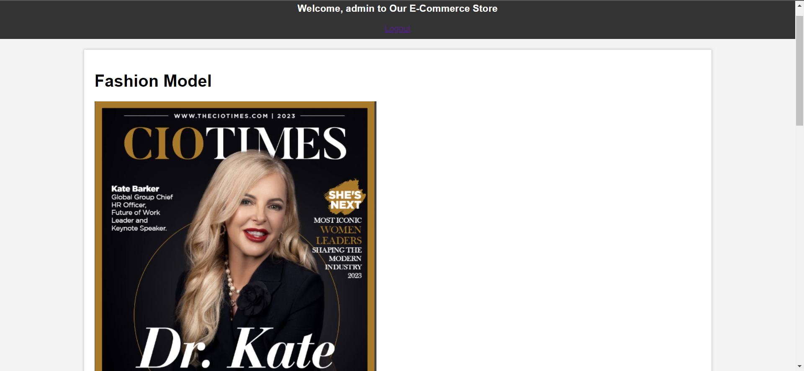
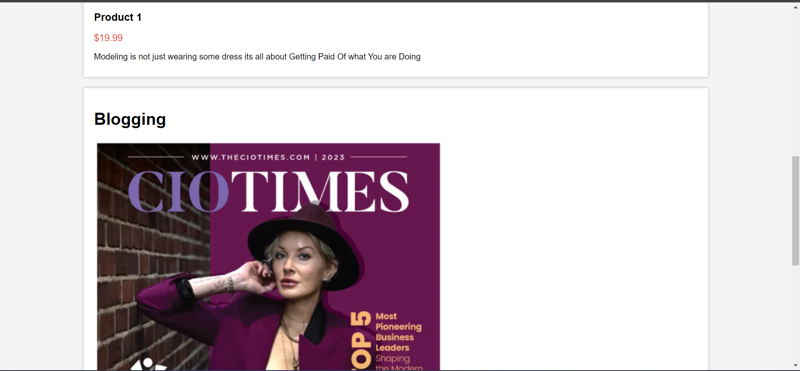

# E-Commerce Website with Django


## Project Overview

This is an e-commerce website built using Django, a high-level Python web framework. The project provides a platform for buying and selling products online.

## Features

- User Registration and Authentication
- Product Catalog with Categories
- User-friendly Shopping Cart
- Secure Payment Processing
- Order History and Tracking
- Product Search and Filtering
- Admin Dashboard for Managing Products and Orders



## Installation

Follow these steps to run the project locally:

```bash
# Clone the repository
git clone https://github.com/your-username/e-commerce-django.git
cd e-commerce-django

# Create a virtual environment and activate it
python -m venv venv
source venv/bin/activate

# Install project dependencies
pip install -r requirements.txt

# Run migrations
python manage.py migrate

# Create a superuser (admin) account
python manage.py createsuperuser

# Start the development server
python manage.py runserver
```

## Managing Website Content

All content displayed on the website, including product information, will be managed through the Django database. This ensures dynamic and efficient handling of website entries.

### Adding New Entries

1. **Products**: You can easily add new products to the website by accessing the admin panel at `http://localhost:8000/admin/`. Log in with your superuser credentials, navigate to the "Products" section, and click "Add Product." Here, you can provide the following information for each product:

   - **Name**: The name of the product.
   - **Detail**: A description or details about the product.
   - **Image**: Upload an image of the product.

   After saving, the product will be displayed on the homepage and in the product catalog.

### Updating or Editing Entries

If you need to update or edit existing entries, you can do so through the admin panel as well. Simply find the product you want to modify, click on it, and make the necessary changes.

### Database Management

Django's powerful ORM (Object-Relational Mapping) handles the underlying database operations. You can further customize the database schema and add more fields as needed in the Django models.

### Displaying Entries on the Homepage

The entries added or edited in the admin panel will automatically appear on the homepage and in the product catalog. Django templates and views ensure that the latest content is displayed to website visitors.

By utilizing the Django admin interface and database management capabilities, you can efficiently maintain and update the content of your e-commerce website.

## Contributing
Contributions to this project are welcome. If you have any bug fixes, improvements, or new features to propose, please submit a pull request.

## License
This project is licensed under the MIT License. See the LICENSE file for details .


