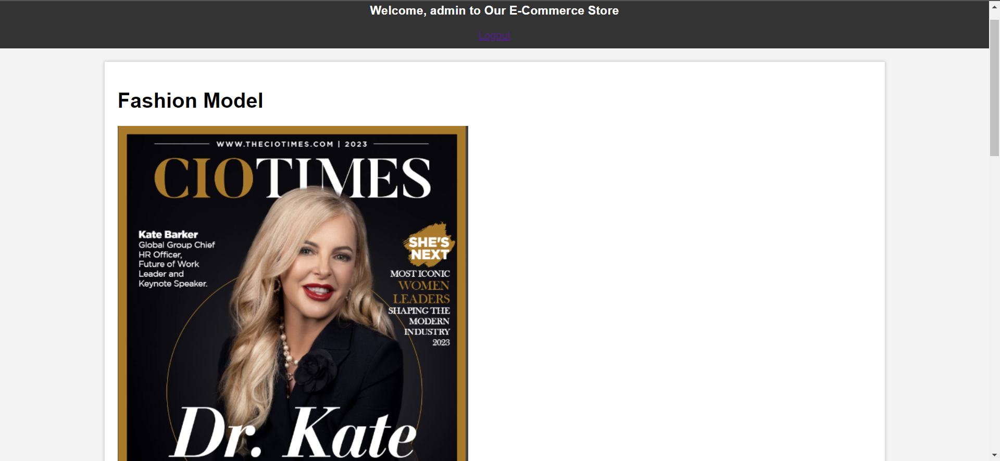

# E-Commerce Website with Django

)
## Project Overview

This is an e-commerce website built using Django, a high-level Python web framework. The project provides a platform for buying and selling products online.

## Features

- User Registration and Authentication
- Product Catalog with Categories
- User-friendly Shopping Cart
- Secure Payment Processing
- Order History and Tracking
- Product Search and Filtering
- Admin Dashboard for Managing Products and Orders

## Installation

Follow these steps to run the project locally:

```bash
# Clone the repository
git clone https://github.com/your-username/e-commerce-django.git
cd e-commerce-django

# Create a virtual environment and activate it
python -m venv venv
source venv/bin/activate

# Install project dependencies
pip install -r requirements.txt

# Run migrations
python manage.py migrate

# Create a superuser (admin) account
python manage.py createsuperuser

# Start the development server
python manage.py runserver
